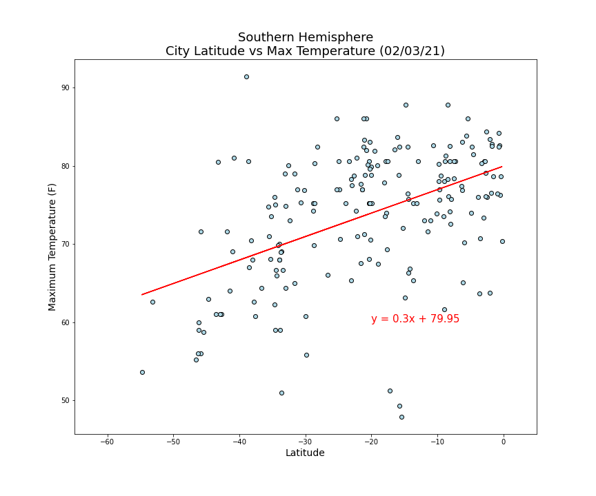
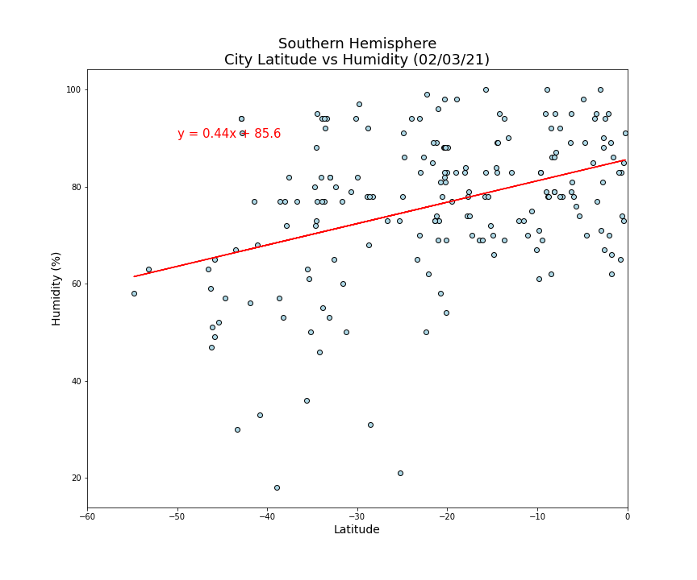

<h1 align='center'>Weather Trends</h1>

<h2>Introduction</h2>

  - Part I - WeatherPy

Does it get hotter as you get closer to the Equator? Does the humidity change near the Equator? Does the cloudiness or wind speed change depending on hemisphere? We've had many years to study these weather trends and may already know the answer, but did you ever want a way to prove those conclusions? Using weather APIs and Python, you can analyze the current weather information for the included list of cities. The included charts and code is based on data pulled on 2/3/21. If the code is downloaded and rerun, it will pull current weather information.

  - Part II - VacationPy

What is the best place to vacation? Are there hotels near by? Using my ideal weather requirements, I narrowed down the cities that fit those requirements. From there, another API was used to find hotels near or in that city. 

<h2>Data</h2>

  - API urls used
     - WeatherPy - "http://api.openweathermap.org/data/2.5/weather?q="
     - VacationPy - "https://maps.googleapis.com/maps/api/place/nearbysearch/json"
     - *note: Check the documentation for the above APIs for registration and/or API keys and formatting*
  - City list CSV
    - [city_data.csv](city_data.csv)

<h2>Analysis/Conclusions</h2>

1. The distance from the equator had a bigger effect on maximum temperature than any other weather conditions.

2. Humidity was the 2nd most affected weather condition.

3. Heatmap with humidity levels and hotel markers.

4. There are additional conclusions found in the Jupyter Notebook [WeatherPy](WeatherPy/WeatherPy.ipynb) with additional charts.
